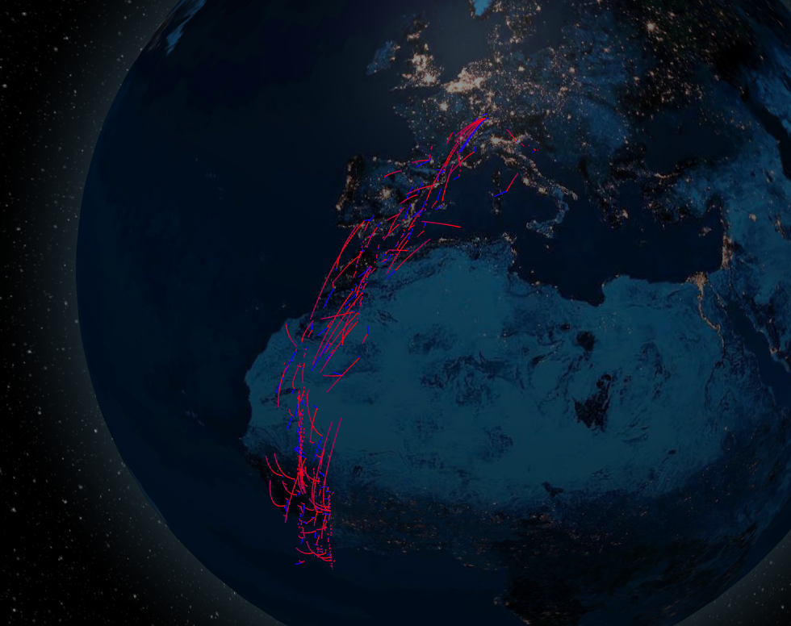
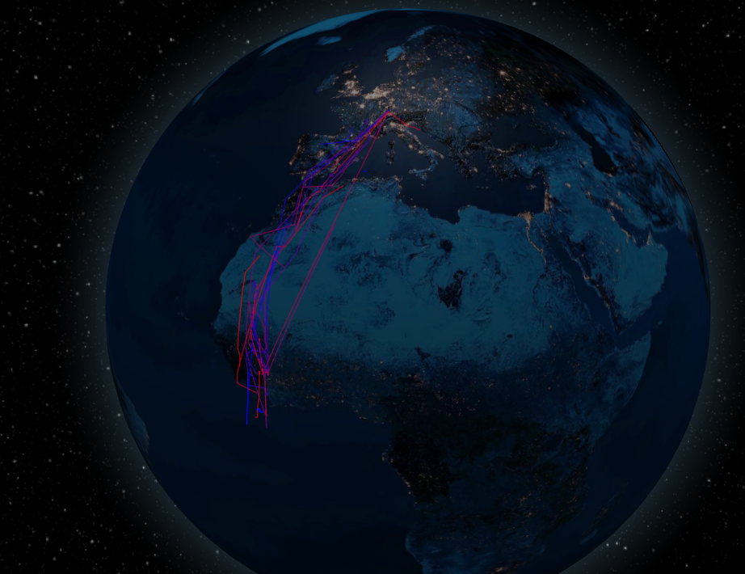
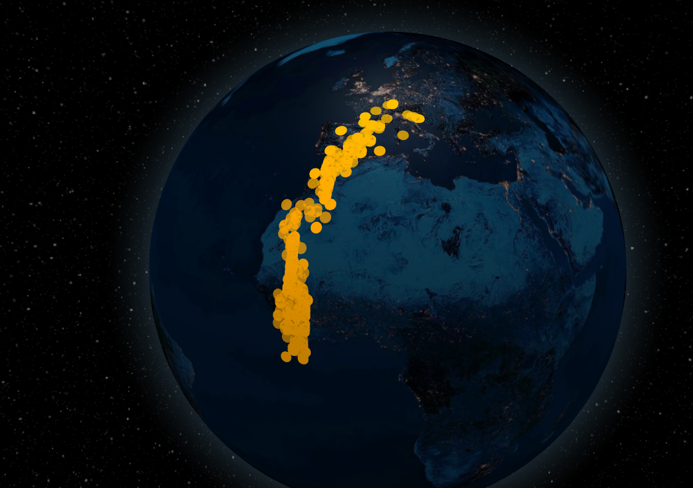

# alpine-swift-migration-visualizer-

The alpine-swift-migration-visualizer- has been created as part of the Module *Software Architecture Labratory* at the Hoschule Karlsruhe. The datasets analyzed for this project are available in the Movebank Data Repository, [movebank](https://www.movebank.org/cms/webapp?gwt_fragment=page%3Dstudies%2Cpath%3Dstudy1266783506), [doi](https://www.movebank.org/cms/webapp?gwt_fragment=page%3Dstudies%2Cpath%3Dstudy1266783506) (Meier CM, Liechti F. 2020. Data from: Study "Switzerland Baden - Long term study on migratory movement of Alpine swifts (Apus melba)". Movebank Data Repository.).

## Use case

This visualizer aims to visualize the migratory routes of the birds and the migration years. The projects gets the possible Bird ID's and possible years from the given csv.    
3 different visualization techniques are possible.

**It is necessary to select either a bird or an Year to see something visualized.**

**Moving Lines**: show more Information.
**Path Lines**: need less ressources then *Moving Lines*.
**Marker**: Only marks the GPS position of the given timestamps.     

    
    

## Necessary tools installed:

[Nodejs](https://nodejs.org/en/)

## How to setup (only once necessary):

You need two shells, both have the root directory: alpine-swift-migration-visualizer- where you can see the client and the server folder.

First shell:   
`cd client`   
`cd alpine-swift-application`   
`npm install`

Second shell:   
`cd server`   
`npm install`   

## Start the application (requires setup)

You need two shells again

first shell:   
navigate into *client/alpine-swift-application* like in the setup    
`npm start`

The other shell:    
*navigate into server*   
`node index.js`   

## Most important: 

**To visualize other data by movebank, rename the following**

location-long -> longitude    
location-lat -> latitude   
tag-local-identifier -> tagLocalIdentifier